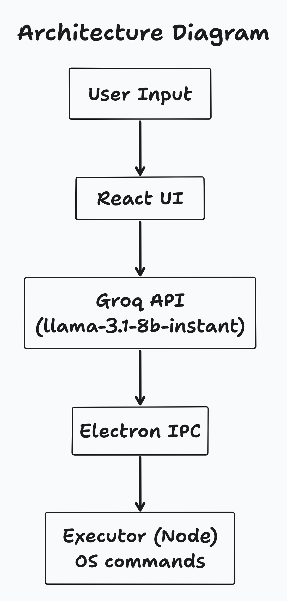

# DeskAgent
DeskAgent is a text-controlled desktop assistant that interprets natural language commands and executes real actions on your computer. Users can type instructions like “open my Documents folder and play the cat video,” and DeskAgent will safely run the corresponding commands.  

Currently, DeskAgent uses the GROQ API (Llama model) to parse text commands and Electron + Node.js to execute them safely on the desktop.


## Installation

### Prerequisites

- Node.js ≥ 18  
- npm or yarn  
- Electron-compatible desktop OS (Windows, macOS, Linux)  

### Steps
1. Clone the repo:
```bash
git clone https://github.com/aahmedfaraz/desktop-ai-agent
cd desktop-ai-agent
```

2. Install dependencies
```
npm install
```

3. Set up environment variables
```
# .env
GROQ_API_KEY=your_groq_api_key_here
```

4. Start the app in development mode
```bash
npm run dev
```

## Usage
1. Open DeskAgent.

2. Type a natural language command in the text box, e.g. _open my documents folder and play the cat video_

3. Hit Submit button. DeskAgent will parse the command and execute it safely.

4. Feedback about executed commands is displayed in the UI.

Note: Only predefined safe actions are allowed:

`open_folder`
`open_file`
`launch_app`
`play_media`

DeskAgent validates paths and applications before running commands to prevent unsafe execution.


## Architecture Diagram

